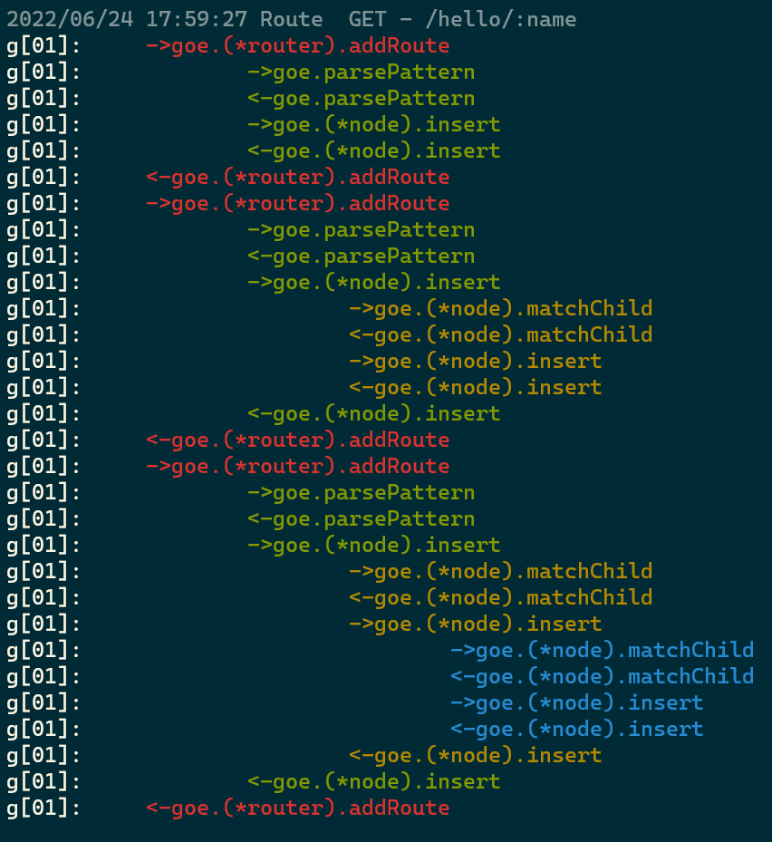
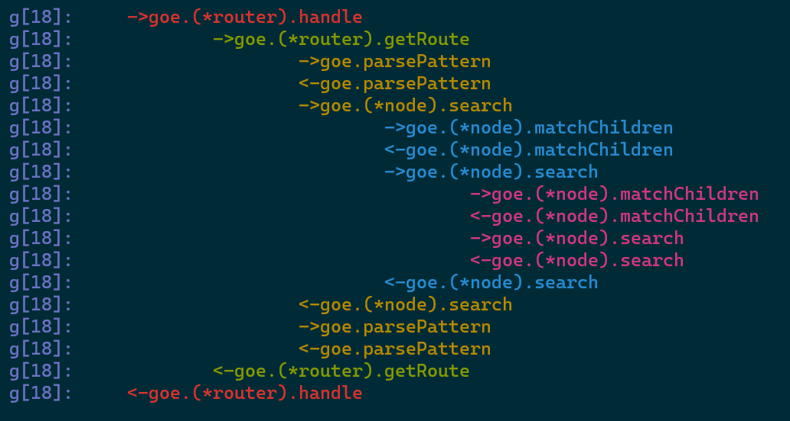

# funchain
print your function-call chain in console

## colorful output

example test code from [7-days-golang/go-web](https://geektutu.com/post/gee-day3.html)
```shell
# output sample
# g[01]: created goroutine id
g[01]:     ->goe.(*router).addRoute
g[01]:             ->goe.parsePattern
g[01]:             <-goe.parsePattern
g[01]:             ->goe.(*node).insert
g[01]:             <-goe.(*node).insert
g[01]:     <-goe.(*router).addRoute
```

`ADD Route`



-----------
`HTTP "GET" request`



## usage
add require in go.mod
```go
require github.com/EnhaoSun/funchain v1.0.0 // indirect
```
-----------
add defer at the beginning of your function
```go
import "github.com/EnhaoSun/funchain"

func () xxx() {
    defer funchain.Trace()()
    //....
}
```
